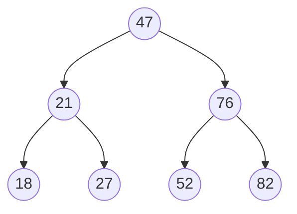

# Tree Traversal (sorting algorithm)



```m
        47
    21      76
  18  27  52  82
```

## Search Types

### Breadth First

- Line by line, traverse & capture tree

  <!-- prettier-ignore -->
  ```js
  [47]
  [21,76]
  [18,27,52,82]

  [47,21,76,18,27,52,82]
  ```

### Depth First (PreOrder)

1. Traverse down a side (e.g. all left) to deepest node (18).
1. Back up to first parent (21).
1. Traverse down the right node (27) (repeat 1 – 3 if there were more children).
1. When left side is completed, return to root node (47) and repeat same pattern for right side of tree.

   <!-- prettier-ignore -->
   ```js
    [47]
    [47,21]
    [47,21,18]
    [47,21,18,27]
    [47,21,18,27,76]
    [47,21,18,27,76,52]
    [47,21,18,27,76,52,82]
    ```
