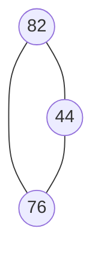

# Graphs

## Graph Elements

- Vertex(proper) or Node `( )`
- Edge: connection between Vertex `/`
  - Bidirectional Edge: solid line.
  - One way Edge: line with arrow.
  - Edge weight: a property/value of edge that defines distance/time to connecting vertex.



```m
  82
 /   \
44 - 76
```

## A few graph data structures

---

### 1. Adjacency Matrix

> Not efficient for large amounts of data/redundant storing of empty info (e.g. 0 in example table)

```m
       a
    /     \
   e       b
    \     /
     d   c

    a b c d e
  a 0 1 0 0 1
  b 1 0 1 0 0
  c 0 1 0 1 0
  d 0 0 1 0 1
  e 1 0 0 1 0
```

#### Big O

##### Time complexity

- Add vertex: O(|V|²)
- Add edge: O(1)
- Remove edge: O(1)
- Remove vertex: O(|V|²)

##### Space complexity

- vertices squared: O(|V|²)

### 2. Adjacency List

> More efficient

```m
           a
        /     \
       e       b
        \     /
         d   c

  {
    A: ["B", "E"],
    B: ["A", "C"],
    C: ["B", "D"],
    D: ["C", "E"],
    E: ["A", "D"]
  }
```

#### Big O

##### Time complexity

- Add vertex: O(1)
- Add edge: O(1)
- Remove edge: O(|E|)
- Remove vertex: O(|V|+|E|)

##### Space complexity

- vertices + edges: O(|V|+|E|)
